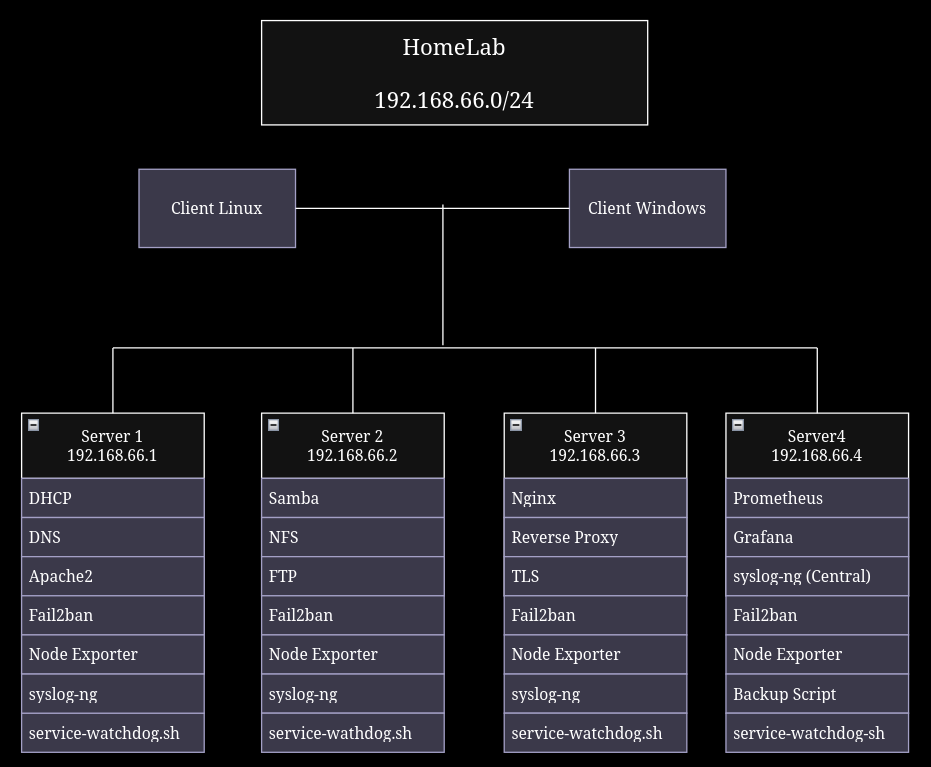
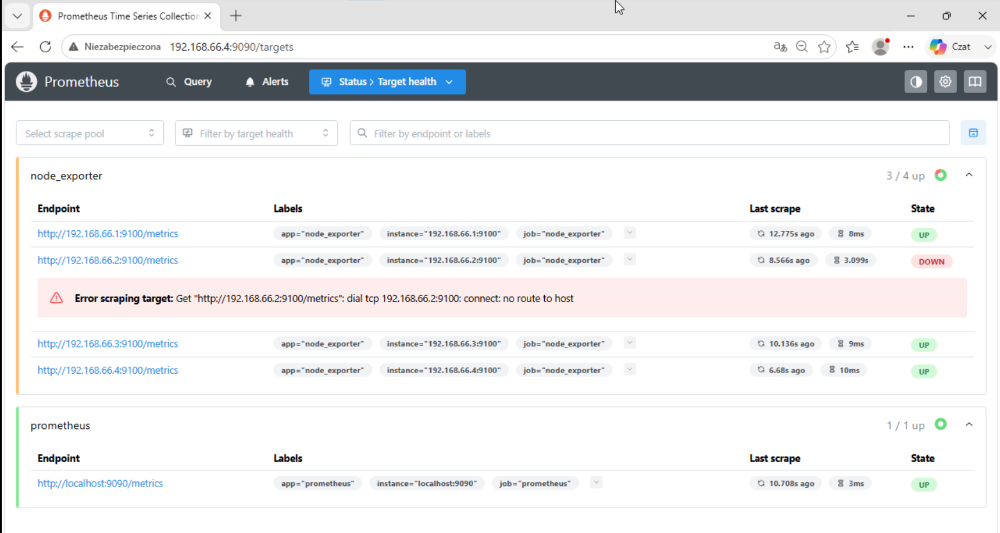
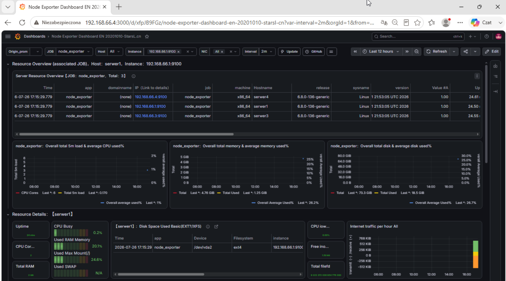
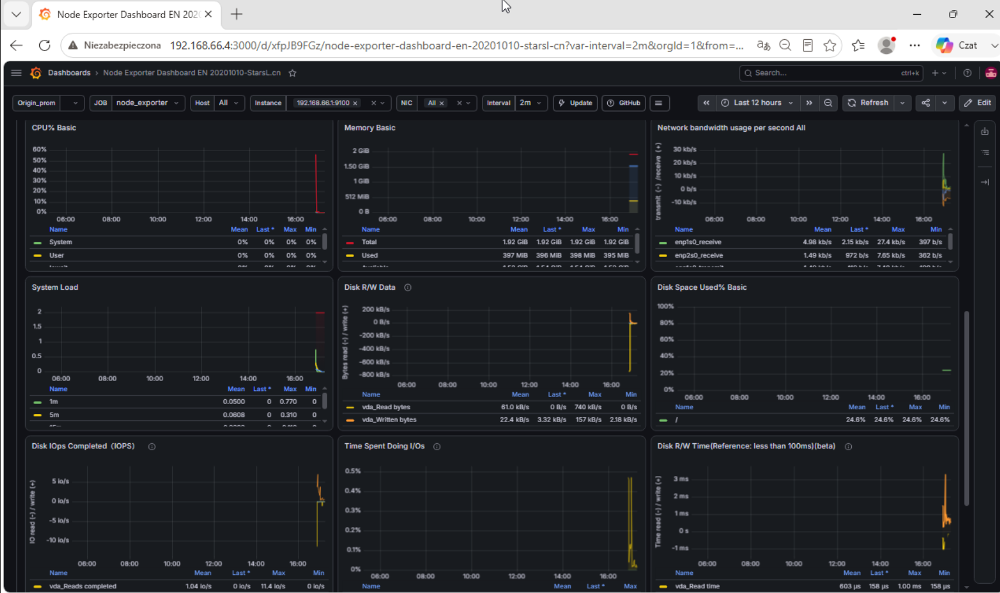
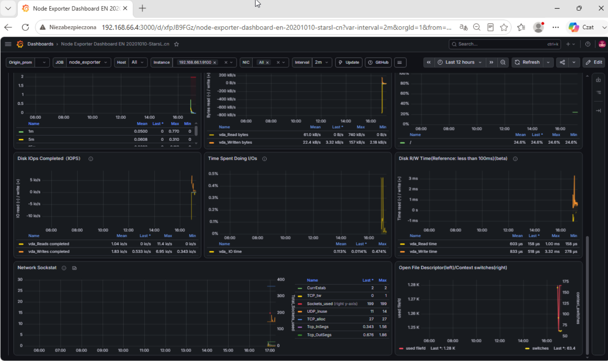

# pierwszy-homelab-Linux-Servers

Projekt przedstawia domowe środowisko laboratoryjne zbudowane na KVM/QEMU, którego celem była nauka administracji systemami Linux.

W projekcie skonfigurowałem cztery serwery Ubuntu Server oraz klienta testowego, na których wdrożyłem usługi sieciowe, monitoring, centralne logowanie, podstawowe mechanizmy bezpieczeństwa oraz automatyzację przy użyciu Bash.

## Cel projektu
Celem projektu było praktyczne poznanie administracji systemami Linux poprzez samodzielne zaprojektowanie i skonfigurowanie niewielkiej infrastruktury składającej się z czterech serwerów oraz klientów testowych. Projekt obejmuje konfigurację usług sieciowych, monitoringu, centralizacji logów, automatyzacji zadań administracyjnych oraz dokumentację całego środowiska.

---

## Środowisko
- **Host:** Ubuntu Server (klient1) (AMD Ryzen 7)
- **Serwery:** Ubuntu Server 24.04
- **Wirtualizacja:** KVM/QEMU + virt-manager
- **Sieć izolowana:** 192.168.66.0/24

## Diagram

## Screenshots

### Prometheus

Screenshot pokazuje że serwer2 nie jest aktywny, ponieważ robiłem test na Windows 10 i jeszcze mam za mało pamięci RAM aby mieć uruchomione wszystkie serwery i klientów.

### Grafana

Tutaj również pokazuje że serwer2 nie jest aktywny z tego samego powodu co napisałem w screenshotach Prometheus.

#### Dashboard Grafana (1/3)

#### Dashboard Grafana (2/3)

#### Dashboard Grafana (3/3)

## Serwery
________________________
| Serwer | IP | Usługi |
|--------|----|--------|
| Server1 | 192.168.66.1 | DHCP, DNS, Apache2 |
| Server2 | 192.168.66.2 | Samba, NFS, FTP |
| Server3 | 192.168.66.3 | Nginx (Reverse Proxy + TLS) |
| Server4 | 192.168.66.4 | Syslog-ng, Prometheus, Grafana

## Zabezpieczenia
- konfiguracja SSH
- podstawowe hardening
- Podstawowy Firewall

---

✅ DHCP

✅ DNS

✅ Apache

✅ Nginx Reverse Proxy + TLS

✅ Samba

✅ NFS

✅ FTP

✅ SSH Hardening

✅ Fail2ban

✅ Syslog-ng

✅ Node Exporter

✅ Prometheus

✅ Grafana

✅ Bash monitoring scripts

✅ Central backup (rsync + tar)

---

## Czego się nauczyłem podczas tego projektu
- konfigurować usługi sieciowe w Linux
- konfiguracji DHCP, DNS, Apache2, Nginx, Samba, NFS, FTP
- Hostować stronę przez Apache2 i dowiedziałem się jak działa i po co jest Reverse Proxy
- podstawy certyfikacji TLS (ale jeszcze nie czuję abym to sprawnie potrafił)
- zabezpieczenia usług przy użyciu SSH i Fail2ban
- wdrożenia monitoringu przy użyciu Node Exporter, Prometheus i Grafana
- tworzyć dashboardy w Grafana
- centralizować logi za pomocą syslog-ng
- automatyzacji zadań administracyjnych w Bash
- tworzyć centralne miejsce dla backups przy pomocy rsync i tar
- rozwiązywać problemy przy pomocy systemctl i journalctl
- tworzenie dokumentacji mojej mini infrastruktury

## Największe problemy napotkane podczas mojego projektu
- konfiguracja DNS i rozwiązywanie nazw
- robienie certyfikatów
- konfiguracja syslog-ng
- problemy z uprawnieniami w skrypcie backup.sh podczas jego wykonywania

## Status projektu
✅ Projekt Zakończony

## Kolejne kroki

Ten projekt stanowi podstawę do mojego następnego projektu, który będzie skupiał się na sieci i jej bezpieczeństwie.

Międzyinnymi będzie to:
- pfSense
- VLAN
- WireGuard VPN
- Firewall
